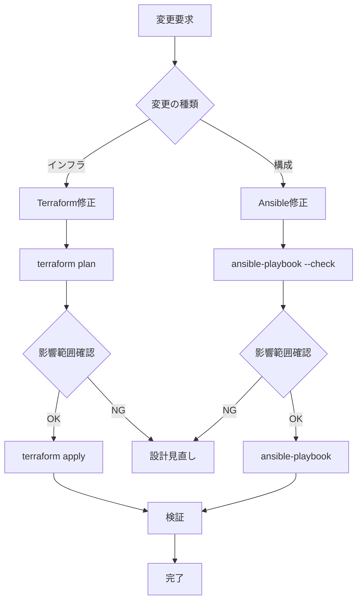

# Terraform + Ansibleで実現する完全IaC運用 - WordPress マルチテナント環境の実践例

## はじめに

「Infrastructure as Code (IaC)」は理念としては理解していても、**実際のプロジェクトでどう使い分けるか**は悩ましいものです。

- TerraformとAnsibleの役割分担は？
- 変数はどこで管理する？
- 環境ごとの差異はどう扱う？
- 本当に再現可能な構成になっているか？

この記事では、GCP上でWordPress マルチテナント環境（10サイト）を構築する過程で確立した **Terraform + Ansibleの実践的な運用パターン** を共有します。

**この記事で扱う内容**:
1. TerraformとAnsibleの責任分離
2. モジュール設計とディレクトリ構造
3. 変数管理とシークレット管理
4. 冪等性の担保と検証
5. 運用フェーズでの変更管理

---

## 1. TerraformとAnsibleの責任分離

### 「何をTerraformで、何をAnsibleで管理するか」

これは**IaC運用の最重要設計判断**です。

### 基本原則: インフラ vs 構成

```
┌─────────────────────────────────────────┐
│           Terraform                     │
│  「リソースの存在」を管理               │
│  - VPCネットワーク                      │
│  - Computeインスタンス                  │
│  - Cloud SQL                            │
│  - ロードバランサ                       │
│  - IAMロール                            │
└─────────────────────────────────────────┘
              ↓ 作成
┌─────────────────────────────────────────┐
│           Ansible                       │
│  「リソースの状態」を管理               │
│  - パッケージインストール               │
│  - 設定ファイル配置                     │
│  - サービス起動                         │
│  - アプリケーションデプロイ             │
└─────────────────────────────────────────┘
```

### 具体的な責任分離表

| 項目 | Terraform | Ansible | 理由 |
|------|----------|---------|------|
| VPCネットワーク作成 | ✅ | ❌ | GCPリソース |
| Computeインスタンス作成 | ✅ | ❌ | GCPリソース |
| Cloud SQL作成 | ✅ | ❌ | GCPリソース |
| Nginx インストール | ❌ | ✅ | OS設定 |
| PHP設定 | ❌ | ✅ | ミドルウェア設定 |
| WordPressデプロイ | ❌ | ✅ | アプリケーション |
| SSL証明書取得 | ❌ | ✅ | アプリケーション層 |
| IAMロール作成 | ✅ | ❌ | GCPリソース |
| Service Account作成 | ✅ | ❌ | GCPリソース |
| ファイアウォールルール | ✅ | ❌ | GCPリソース |
| NFSマウント | ❌ | ✅ | OS設定 |

### 判断基準

**Terraformで管理すべきもの**:
```yaml
✅ GCP APIで作成・管理されるリソース
✅ 削除するとデータロスのリスクがあるもの
✅ 複数環境で共通の定義
✅ 依存関係が複雑なもの
```

**Ansibleで管理すべきもの**:
```yaml
✅ OSレベルの設定
✅ パッケージのインストール
✅ 設定ファイルの配置・テンプレート化
✅ サービスの起動・停止
✅ アプリケーションコードのデプロイ
✅ 頻繁に変更されるもの
```

### グレーゾーンの判断例

#### ケース1: Computeインスタンスのメタデータ

**選択肢**:
1. Terraformでメタデータとして設定
2. Ansibleで動的に取得

**今回の判断**: Terraformで設定、Ansibleで読み取り
```hcl
# Terraform
resource "google_compute_region_instance_template" "web" {
  metadata = {
    env      = var.env
    db_host  = module.database.private_ip_address
    nfs_ip   = var.nfs_ip
    nfs_path = var.nfs_path
  }
}
```

```yaml
# Ansible
- name: メタデータから環境情報取得
  uri:
    url: "http://metadata.google.internal/computeMetadata/v1/instance/attributes/db_host"
    headers:
      Metadata-Flavor: "Google"
    return_content: yes
  register: db_host_metadata
```

**理由**: インフラ情報はTerraformが単一真実の情報源(SSOT)

#### ケース2: データベースパスワード

**選択肢**:
1. Terraformで生成してSecret Managerに保存
2. Ansibleで生成

**今回の判断**: Terraformで生成
```hcl
# Terraform
resource "random_password" "db_passwords" {
  count   = 10
  length  = 20
  special = true
}

resource "google_secret_manager_secret_version" "db_passwords" {
  count       = 10
  secret      = google_secret_manager_secret.db_passwords[count.index].id
  secret_data = random_password.db_passwords[count.index].result
}
```

**理由**: インフラ層のリソース（Cloud SQL User）と密接に関連

---

## 2. モジュール設計とディレクトリ構造

### プロジェクト全体のディレクトリ構造

```
infra-ai-agent/
├── terraform/
│   ├── modules/           # 再利用可能なモジュール
│   │   ├── network/
│   │   ├── compute/
│   │   ├── database/
│   │   ├── filestore/
│   │   ├── loadbalancer/
│   │   ├── iam/
│   │   └── monitoring/
│   └── environments/      # 環境ごとの設定
│       ├── dev/
│       │   ├── main.tf
│       │   ├── variables.tf
│       │   ├── terraform.tfvars
│       │   └── outputs.tf
│       └── prod/
│           ├── main.tf
│           ├── variables.tf
│           ├── terraform.tfvars
│           └── outputs.tf
├── ansible/
│   ├── inventory/         # 動的インベントリ
│   │   └── gcp.yml
│   ├── playbooks/         # Playbook
│   │   └── deploy-wordpress.yml
│   └── roles/             # ロール
│       └── wordpress/
│           ├── tasks/
│           ├── templates/
│           ├── files/
│           └── defaults/
└── scripts/               # 運用スクリプト
    └── sync-db-passwords.sh
```

### Terraformモジュール設計原則

#### 原則1: 単一責任の原則

各モジュールは1つのGCPサービスに対応：

```hcl
# ❌ 悪い例: すべてを1つのモジュールに
module "wordpress_infra" {
  source = "../../modules/all"
  # すべてのリソースをここで作成
}

# ✅ 良い例: 責任を分離
module "network" {
  source = "../../modules/network"
}

module "database" {
  source = "../../modules/database"
  depends_on = [module.network]
}

module "compute" {
  source = "../../modules/compute"
  depends_on = [module.database]
}
```

#### 原則2: 依存関係の明示

```hcl
# terraform/environments/prod/main.tf
module "compute" {
  source = "../../modules/compute"

  db_host = module.database.private_ip_address  # 明示的な依存
  nfs_ip  = module.filestore.nfs_ip

  depends_on = [module.database, module.filestore]
}
```

#### 原則3: 出力値の活用

```hcl
# terraform/modules/database/outputs.tf
output "private_ip_address" {
  description = "Cloud SQL Private IP Address"
  value       = google_sql_database_instance.wordpress.private_ip_address
}

output "instance_connection_name" {
  description = "Cloud SQL Instance Connection Name"
  value       = google_sql_database_instance.wordpress.connection_name
}

output "database_names" {
  description = "List of database names"
  value       = google_sql_database.wordpress_dbs[*].name
}
```

### モジュール構造の例: Database

```
terraform/modules/database/
├── main.tf           # メインリソース定義
├── variables.tf      # 入力変数
├── outputs.tf        # 出力値
└── README.md         # モジュールのドキュメント
```

**main.tf**:
```hcl
resource "google_sql_database_instance" "wordpress" {
  name             = "${var.env}-wordpress-db"
  database_version = "MYSQL_8_0"
  region           = var.region

  settings {
    tier              = var.tier
    availability_type = var.availability_type

    ip_configuration {
      ipv4_enabled    = false
      private_network = var.network_id
      require_ssl     = false
    }

    backup_configuration {
      enabled            = true
      start_time         = "03:00"
      binary_log_enabled = true
    }
  }
}

resource "google_sql_database" "wordpress_dbs" {
  count    = 10
  name     = "wordpress_db_${count.index + 1}"
  instance = google_sql_database_instance.wordpress.name
}

resource "google_sql_user" "wordpress_users" {
  count    = 10
  name     = "wp_user_${count.index + 1}"
  instance = google_sql_database_instance.wordpress.name
  password = random_password.db_passwords[count.index].result
}
```

**variables.tf**:
```hcl
variable "env" {
  description = "Environment name"
  type        = string
}

variable "region" {
  description = "GCP region"
  type        = string
}

variable "tier" {
  description = "Cloud SQL machine tier"
  type        = string
  default     = "db-f1-micro"
}

variable "network_id" {
  description = "VPC network ID for private IP"
  type        = string
}
```

### Ansibleロール設計

#### ディレクトリ構造

```
ansible/roles/wordpress/
├── tasks/
│   ├── main.yml          # エントリーポイント
│   ├── packages.yml      # パッケージインストール
│   ├── nginx.yml         # Nginx設定
│   ├── php.yml           # PHP設定
│   ├── wpcli.yml         # WP-CLIインストール
│   ├── nfs.yml           # NFSマウント
│   └── scripts.yml       # スクリプト配置
├── templates/
│   ├── nginx-site.conf.j2
│   ├── php-fpm-pool.conf.j2
│   └── setup-wordpress-site.sh.j2
├── files/
│   └── cloudflare-origin-ca.pem
├── defaults/
│   └── main.yml          # デフォルト変数
└── handlers/
    └── main.yml          # サービス再起動ハンドラ
```

#### tasks/main.yml (エントリーポイント)

```yaml
---
- name: パッケージインストール
  import_tasks: packages.yml
  tags: packages

- name: Nginx設定
  import_tasks: nginx.yml
  tags: nginx

- name: PHP設定
  import_tasks: php.yml
  tags: php

- name: NFS設定
  import_tasks: nfs.yml
  tags: nfs

- name: WP-CLI インストール
  import_tasks: wpcli.yml
  tags: wpcli

- name: スクリプト配置
  import_tasks: scripts.yml
  tags: scripts
```

これにより、特定のタスクのみ実行可能：
```bash
# Nginxだけ再設定
ansible-playbook -i inventory/gcp.yml playbooks/deploy-wordpress.yml --tags nginx

# WP-CLIだけ更新
ansible-playbook -i inventory/gcp.yml playbooks/deploy-wordpress.yml --tags wpcli
```

---

## 3. 変数管理とシークレット管理

### 変数管理の階層

```
┌─────────────────────────────────────────┐
│  1. デフォルト値 (defaults/main.yml)    │  優先度: 低
└────────────┬────────────────────────────┘
             ↓
┌─────────────────────────────────────────┐
│  2. 環境固有値 (terraform.tfvars)       │  優先度: 中
└────────────┬────────────────────────────┘
             ↓
┌─────────────────────────────────────────┐
│  3. コマンドライン (-e "var=value")     │  優先度: 高
└─────────────────────────────────────────┘
```

### Terraform変数の管理

#### terraform.tfvars (本番環境)

```hcl
# terraform/environments/prod/terraform.tfvars
env        = "prod"
project_id = "infra-ai-agent"
region     = "asia-northeast1"
zone       = "asia-northeast1-a"

# Compute
machine_type = "e2-micro"
min_replicas = 3
max_replicas = 10

# Database
db_tier              = "db-f1-micro"
db_availability_type = "ZONAL"

# Filestore
filestore_tier        = "BASIC_HDD"
filestore_capacity_gb = 1024

# Domains
domains = [
  "ai-jisso.tech",
  "dev-ops.tech",
  "cloud-native.tech",
  "kube-master.tech",
  "infra-code.tech",
  "serverless-app.tech",
  "micro-service.tech",
  "data-pipeline.tech",
  "ml-platform.tech",
  "edge-computing.tech"
]
```

#### terraform.tfvars (開発環境)

```hcl
# terraform/environments/dev/terraform.tfvars
env        = "dev"
project_id = "infra-ai-agent-dev"
region     = "asia-northeast1"
zone       = "asia-northeast1-a"

# Compute (開発環境は小さめ)
machine_type = "e2-micro"
min_replicas = 1
max_replicas = 3

# Database (開発環境は最小構成)
db_tier              = "db-f1-micro"
db_availability_type = "ZONAL"  # 高可用性は不要

# Filestore (開発環境は最小容量)
filestore_tier        = "BASIC_HDD"
filestore_capacity_gb = 256

# Domains (開発用ドメイン)
domains = [
  "dev.ai-jisso.tech",
  "staging.ai-jisso.tech"
]
```

### Ansibleの変数管理

#### defaults/main.yml

```yaml
---
# PHP設定
php_version: "8.2"
php_memory_limit: "256M"
php_max_execution_time: "300"
php_upload_max_filesize: "64M"

# Nginx設定
nginx_worker_connections: 1024
nginx_client_max_body_size: "64M"

# WordPress設定
wordpress_version: "latest"
wpcli_url: "https://raw.githubusercontent.com/wp-cli/builds/gh-pages/phar/wp-cli.phar"
wpcli_bin_path: "/usr/local/bin/wp"

# NFS設定
nfs_mount_point: "/var/www/wordpress"
nfs_mount_options: "defaults,hard,intr"
```

#### Playbook内での変数上書き

```yaml
# ansible/playbooks/deploy-wordpress.yml
- name: WordPress デプロイ
  hosts: label_service_wordpress
  become: yes

  vars:
    env: "{{ lookup('env', 'ENV') | default('prod', true) }}"
    gcp_project_id: "{{ lookup('env', 'GCP_PROJECT_ID') | default('', true) }}"
```

#### コマンドラインからの上書き

```bash
# 特定の変数を上書きして実行
ansible-playbook -i inventory/gcp.yml playbooks/deploy-wordpress.yml \
  -e "db_host=10.168.0.2" \
  -e "nfs_ip=10.0.3.2" \
  -e "nfs_path=/wordpress"
```

### シークレット管理

#### NGパターン

```yaml
# ❌ 絶対にやってはいけない
vars:
  db_password: "my_secret_password"  # 平文でコミット
```

#### 正しいパターン

**Option 1: Secret Managerから動的取得**
```yaml
# ✅ 推奨
- name: Secret Managerからパスワード取得
  command: >
    gcloud secrets versions access latest
    --secret={{ env }}-wordpress-db-password-{{ item }}
    --project={{ gcp_project_id }}
  register: db_password
  no_log: true  # ログに出力しない
  loop: "{{ range(1, 11) | list }}"
```

**Option 2: Ansible Vault**
```bash
# パスワードを暗号化
ansible-vault encrypt_string 'my_secret_password' --name 'db_password'

# 実行時に復号化
ansible-playbook -i inventory/gcp.yml playbooks/deploy-wordpress.yml \
  --ask-vault-pass
```

**Option 3: 環境変数**
```yaml
vars:
  db_password: "{{ lookup('env', 'DB_PASSWORD') }}"
```

```bash
# 実行時に環境変数を設定
export DB_PASSWORD="my_secret_password"
ansible-playbook -i inventory/gcp.yml playbooks/deploy-wordpress.yml
```

---

## 4. 冪等性の担保と検証

### 冪等性とは

**同じ操作を複数回実行しても、結果が変わらない性質**

```
terraform apply  # 1回目: リソース作成
terraform apply  # 2回目: 何も変更なし ← 冪等性

ansible-playbook deploy.yml  # 1回目: 設定適用
ansible-playbook deploy.yml  # 2回目: 何も変更なし ← 冪等性
```

### Terraformの冪等性

Terraformは**宣言的**なため、基本的に冪等性が保証されます：

```hcl
# 常に同じ状態を宣言
resource "google_compute_instance" "web" {
  name         = "prod-web-server"
  machine_type = "e2-micro"
}
```

#### 冪等性を壊す例

```hcl
# ❌ 悪い例: タイムスタンプを含む
resource "google_compute_instance" "web" {
  name = "web-${timestamp()}"  # 実行のたびに異なる名前
}

# ✅ 良い例: 固定値または環境変数
resource "google_compute_instance" "web" {
  name = "${var.env}-web-server"
}
```

#### 冪等性の検証

```bash
# 1回目の実行
terraform apply

# 2回目の実行（変更がないことを確認）
terraform plan
# 出力: No changes. Your infrastructure matches the configuration.
```

### Ansibleの冪等性

Ansibleも基本的に冪等性を持つが、**コマンド実行時は注意が必要**：

#### 冪等的なタスク

```yaml
# ✅ パッケージインストール（冪等的）
- name: Nginxインストール
  apt:
    name: nginx
    state: present  # すでにインストール済みなら何もしない
```

#### 非冪等的なタスク

```yaml
# ❌ コマンド実行（常に実行される）
- name: ファイルに追記
  command: echo "log entry" >> /var/log/myapp.log
  # 実行のたびに追記される！
```

#### 冪等性を担保する方法

**方法1: changed_when を使う**
```yaml
- name: 設定ファイルの存在確認
  command: test -f /etc/myapp/config.yml
  register: config_check
  changed_when: false  # 常に "changed" にならない
  failed_when: config_check.rc not in [0, 1]
```

**方法2: creates パラメータを使う**
```yaml
- name: WP-CLI ダウンロード
  get_url:
    url: "{{ wpcli_url }}"
    dest: /tmp/wp-cli.phar
    creates: /tmp/wp-cli.phar  # ファイルが存在すればスキップ
```

**方法3: stat モジュールで事前チェック**
```yaml
- name: 設定ファイルの存在確認
  stat:
    path: /etc/nginx/sites-available/wordpress.conf
  register: nginx_conf

- name: Nginx設定ファイル配置
  template:
    src: nginx-site.conf.j2
    dest: /etc/nginx/sites-available/wordpress.conf
  when: not nginx_conf.stat.exists
```

### 冪等性のテスト

**Ansible Dry Run**:
```bash
# チェックモード（実際には変更しない）
ansible-playbook -i inventory/gcp.yml playbooks/deploy-wordpress.yml --check

# 差分表示
ansible-playbook -i inventory/gcp.yml playbooks/deploy-wordpress.yml --check --diff
```

**2回実行して検証**:
```bash
# 1回目
ansible-playbook -i inventory/gcp.yml playbooks/deploy-wordpress.yml

# 2回目（変更がないことを確認）
ansible-playbook -i inventory/gcp.yml playbooks/deploy-wordpress.yml

# 出力例
# PLAY RECAP *******************************************
# prod-web-l0br : ok=25 changed=0 unreachable=0 failed=0
#                       ^^^^^^^^^ 変更なし！
```

---

## 5. 運用フェーズでの変更管理

### 変更の種類と対応方法

| 変更の種類 | 使用ツール | 例 |
|-----------|-----------|-----|
| インフラリソース追加 | Terraform | Computeインスタンス追加 |
| インフラ設定変更 | Terraform | Cloud SQL SSL無効化 |
| ミドルウェア設定変更 | Ansible | Nginx worker数変更 |
| アプリケーションデプロイ | Ansible | WordPress更新 |
| 緊急対応 | 手動 + 後でIaC化 | サービス再起動 |

### 変更フロー



### ケーススタディ1: Cloud SQL SSL無効化

**変更内容**: `require_ssl = true` → `false`

**手順**:
```bash
# 1. Terraform設定変更
cd terraform/environments/prod
vim ../../modules/database/main.tf
# require_ssl = false に変更

# 2. 差分確認
terraform plan
# Cloud SQL設定が変更されることを確認

# 3. 適用
terraform apply

# 4. 影響確認
gcloud sql instances describe prod-wordpress-db \
  --format="value(settings.ipConfiguration.requireSsl)"
# 出力: False

# 5. WordPressから接続テスト
ansible-playbook -i ../../ansible/inventory/gcp.yml \
  ../../ansible/playbooks/deploy-wordpress.yml
```

**結果**: インスタンステンプレートが変更され、インスタンスが再作成された

**学び**: Instance Template変更はインスタンス再作成を引き起こす

### ケーススタディ2: Nginx設定変更

**変更内容**: worker_connections を 1024 → 2048 に変更

**手順**:
```bash
# 1. Ansible変数変更
cd ansible/roles/wordpress
vim defaults/main.yml
# nginx_worker_connections: 2048 に変更

# 2. ドライラン
cd ../../
ansible-playbook -i inventory/gcp.yml playbooks/deploy-wordpress.yml \
  --tags nginx --check --diff

# 3. 適用
ansible-playbook -i inventory/gcp.yml playbooks/deploy-wordpress.yml \
  --tags nginx

# 4. 確認
ansible -i inventory/gcp.yml label_service_wordpress \
  -m shell -a "nginx -T | grep worker_connections" --become
```

**結果**: Nginxがリロードされ、新しい設定が反映された

**学び**: タグを使って部分的な変更が可能

### ケーススタディ3: 緊急対応（サービス再起動）

**状況**: WordPressサイトが応答しなくなった

**緊急対応**:
```bash
# 手動でサービス再起動
gcloud compute ssh prod-web-l0br \
  --zone=asia-northeast1-a \
  --tunnel-through-iap \
  --command="sudo systemctl restart php8.2-fpm nginx"
```

**後処理**:
```bash
# 原因調査
ansible-playbook -i inventory/gcp.yml playbooks/deploy-wordpress.yml \
  --tags nginx,php

# 設定が正しいことを確認
# 必要に応じてAnsible Playbookを修正
```

**学び**: 緊急時は手動対応OK、ただし後で必ずIaC化

### Gitワークフロー

```bash
# 1. ブランチ作成
git checkout -b feature/disable-cloud-sql-ssl

# 2. 変更実施
vim terraform/modules/database/main.tf

# 3. コミット
git add terraform/modules/database/main.tf
git commit -m "feat: disable Cloud SQL SSL requirement for private IP connection"

# 4. テスト環境で検証
cd terraform/environments/dev
terraform plan
terraform apply

# 5. プッシュ
git push origin feature/disable-cloud-sql-ssl

# 6. プルリクエスト作成
# GitHub上でレビュー

# 7. マージ後、本番適用
git checkout main
git pull
cd terraform/environments/prod
terraform apply
```

---

## 6. ベストプラクティス

### Terraform

```yaml
□ モジュール化で再利用性を高める
□ terraform.tfvarsで環境ごとの差異を管理
□ terraform planで必ず変更内容を確認
□ ステートファイルをリモートバックエンドで管理（GCS等）
□ ステートファイルのロック機能を有効化
□ 破壊的変更は lifecycle.prevent_destroy で保護
□ 出力値を活用してモジュール間連携
```

### Ansible

```yaml
□ ロールで機能を分割
□ タグで部分実行を可能に
□ テンプレートで設定ファイルを動的生成
□ ハンドラでサービス再起動を自動化
□ no_log でシークレット情報の漏洩を防止
□ changed_when で冪等性を担保
□ --check --diff でドライラン
```

### 変数管理

```yaml
□ シークレットは平文で保存しない
□ Secret Manager / Ansible Vaultを活用
□ 環境ごとの差異はtfvarsで管理
□ デフォルト値はdefaults/main.ymlに
□ コマンドラインからの上書きを許可
```

### 運用

```yaml
□ 変更前に必ずplanまたは--check
□ Gitでバージョン管理
□ プルリクエストでレビュー
□ テスト環境で先に検証
□ ドキュメントを更新
□ 変更履歴をコミットメッセージに記録
```

---

## まとめ

### TerraformとAnsibleの使い分け

| ツール | 役割 | 再実行の影響 |
|-------|------|-------------|
| Terraform | インフラリソースの作成・管理 | べき等（差分のみ適用） |
| Ansible | OS・ミドルウェア・アプリの設定 | べき等（変更検知） |

### 成功のポイント

1. **明確な責任分離**
   - Terraformはインフラ層
   - Ansibleは構成管理層

2. **変数管理の一元化**
   - 環境ごとの差異をtfvarsで管理
   - シークレットはSecret Managerで管理

3. **冪等性の担保**
   - 何度実行しても安全
   - ドライランで事前確認

4. **Gitによるバージョン管理**
   - すべての変更を記録
   - レビュープロセスの導入

5. **ドキュメント化**
   - モジュールの使い方を記録
   - 運用手順を文書化

### 次のステップ

- CI/CDパイプラインの構築
- Terraformステートのリモート管理
- Ansibleの実行をCI/CDに統合
- 自動テストの追加

---

## 参考リンク

- [Terraform Best Practices](https://www.terraform-best-practices.com/)
- [Ansible Best Practices](https://docs.ansible.com/ansible/latest/tips_tricks/ansible_tips_tricks.html)
- [Google Cloud Terraform Provider](https://registry.terraform.io/providers/hashicorp/google/latest/docs)
- [Ansible gcp_compute collection](https://docs.ansible.com/ansible/latest/collections/google/cloud/gcp_compute_inventory.html)

---

## この記事のコード

GitHub: [infra-ai-agent](https://github.com/0xchoux1/infra-ai-agent)

Terraformモジュール:
- [terraform/modules/](https://github.com/0xchoux1/infra-ai-agent/tree/main/terraform/modules)

Ansible Playbook:
- [ansible/playbooks/deploy-wordpress.yml](https://github.com/0xchoux1/infra-ai-agent/blob/main/ansible/playbooks/deploy-wordpress.yml)
- [ansible/roles/wordpress/](https://github.com/0xchoux1/infra-ai-agent/tree/main/ansible/roles/wordpress)

---

**この記事が役に立ったら**: GitHub Starをいただけると嬉しいです！ [infra-ai-agent](https://github.com/0xchoux1/infra-ai-agent)
