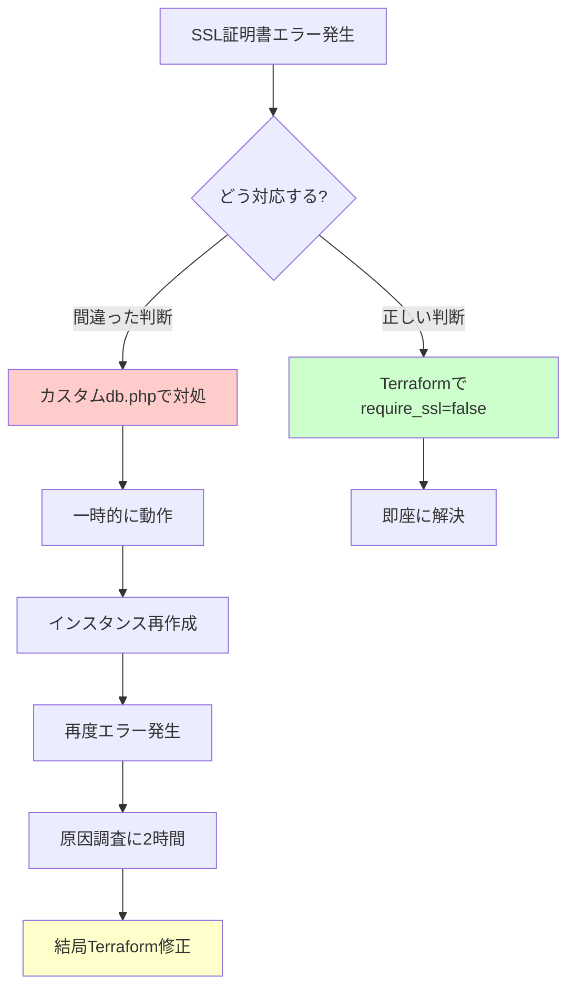

# 【失敗から学ぶ】Cloud SQL SSL設定で2時間ハマった話 - 判断ミスの分析と再発防止策

## はじめに

「とりあえず動けばいい」

この思考が、2時間の無駄な試行錯誤を生み出しました。

GCP上でWordPress マルチテナント環境を構築していた際、Cloud SQLのSSL証明書エラーに遭遇しました。その時に取った「アプリケーション層での対症療法」というアプローチが、いかに間違っていたか。そして、なぜそのような判断をしてしまったのか。

この記事では、**失敗の過程を包み隠さず共有**し、同じミスを繰り返さないための教訓を整理します。

---

## 1. 問題の発生経緯

### 最初のエラーメッセージ

WordPressのインストール中、こんなエラーに遭遇しました：

```
Error establishing a database connection
```

詳細を確認すると：

```
mysqli_real_connect(): SSL operation failed with code 1. OpenSSL Error messages:
error:0A000126:SSL routines::unexpected eof while reading
```

**その時の私の思考**:
- 「SSL証明書の問題だな」
- 「WordPressがCloud SQLのSSL証明書を読み込めていない」
- 「→ アプリケーション側で証明書を設定すれば解決するはず」

この判断が、すべての間違いの始まりでした。

---

## 2. 判断ミス1: カスタムdb.phpによる対症療法

### 取ったアプローチ（間違い）

私は `wp-content/db.php` というカスタムMySQLドライバを作成しました：

```php
<?php
// カスタムMySQLドライバ - SSL証明書を設定
class wpdb extends wpdb {
    public function db_connect($allow_bail = true) {
        $this->dbh = new mysqli(
            DB_HOST,
            DB_USER,
            DB_PASSWORD,
            DB_NAME,
            3306,
            null
        );

        // SSL証明書設定
        $this->dbh->ssl_set(
            '/var/www/certs/client-key.pem',
            '/var/www/certs/client-cert.pem',
            '/var/www/certs/server-ca.pem',
            null,
            null
        );

        return $this->dbh->real_connect(
            DB_HOST,
            DB_USER,
            DB_PASSWORD,
            DB_NAME,
            3306,
            null,
            MYSQLI_CLIENT_SSL
        );
    }
}
```

### この判断の何が問題だったのか

#### 問題1: アプリケーション層で解決しようとした

- **根本原因**: Cloud SQLのデフォルト設定が `require_ssl = true`
- **私の対応**: アプリケーション側でSSL証明書を設定
- **正しい対応**: Terraformで `require_ssl = false` に設定すべきだった

```hcl
# 正しいアプローチ（Terraform）
resource "google_sql_database_instance" "wordpress" {
  settings {
    ip_configuration {
      require_ssl = false  # ← これだけで解決
    }
  }
}
```

#### 問題2: IaC原則違反

- カスタムファイル（db.php）を手動で配置
- Ansible管理外のファイル
- 他のサーバーへの展開時に再現性がない
- Git管理されていない

#### 問題3: WordPressコアの動作を変更

- `wp-content/db.php` はWordPressの「ドロップインファイル」
- WordPressのデータベース接続ロジック全体を上書き
- 将来のWordPressアップデートで互換性問題のリスク

---

## 3. 判断ミス2: Terraformでの根本対応を後回しにした

### なぜ後回しにしたのか

**私の思考プロセス**:
1. 「カスタムdb.phpで動いた！」
2. 「とりあえずWordPressのインストールを進めよう」
3. 「インフラ設定の変更は後でいいや」

この「とりあえず動けばいい」思考が致命的でした。

### 後回しにした結果

1. **新しいインスタンスで同じエラー**
   - Terraform applyでインスタンスが再作成
   - カスタムdb.phpが存在しない
   - 再度同じエラーに遭遇

2. **デバッグの混乱**
   - 「なぜ動いていたのに動かなくなった？」
   - カスタムdb.phpの存在を忘れていた
   - NFSマウントされたファイルの把握が困難

3. **最終的にカスタムdb.phpを削除**
   - Terraformで `require_ssl = false` に変更
   - カスタムdb.phpを削除
   - あっさり解決

---

## 4. 時系列でみる判断の分岐点



### 各ポイントでの「取るべきだった行動」

| 時点 | 実際の行動 | 取るべきだった行動 |
|------|-----------|-------------------|
| エラー発生 | アプリ層で解決を試みる | インフラ設定を確認 |
| カスタムdb.php作成 | 「動いた！」と満足 | 根本原因を調査 |
| 一時的に動作 | 次のタスクに進む | Terraform修正を完了 |
| インスタンス再作成 | 「なぜ動かない？」と混乱 | - |
| 2時間後 | Terraform修正 | 最初からこうすべきだった |

---

## 5. 根本原因分析: なぜ判断を誤ったのか

### 原因1: Cloud SQLのデフォルト設定への理解不足

**知らなかったこと**:
- Cloud SQLのデフォルトは `require_ssl = true`
- プライベートIP接続でもSSL要件は有効
- SSL証明書は手動で発行・配布する必要がある

**学んだこと**:
```bash
# Cloud SQLの設定確認コマンド
gcloud sql instances describe INSTANCE_NAME \
  --format="value(settings.ipConfiguration.requireSsl)"
```

### 原因2: エラーメッセージの表面的な読み取り

**エラーメッセージ**:
```
SSL operation failed
```

**私の解釈**: 「証明書が足りない」
**正しい解釈**: 「そもそもSSL接続が必要ない環境でSSLを要求されている」

### 原因3: アプリケーション層で解決しようとするバイアス

**私の背景**:
- アプリケーションエンジニア出身
- インフラ設定よりコード修正に慣れている
- 「コードで解決できる」という思い込み

**バイアスの罠**:
- アプリ層で解決 = 「すぐできる」「簡単」
- インフラ層の変更 = 「面倒」「怖い」「影響範囲が大きい」

**現実**:
| 対応 | 実装時間 | デバッグ時間 | 保守性 |
|------|---------|-------------|--------|
| カスタムdb.php | 30分 | 2時間 | 低 |
| Terraform修正 | 5分 | 0分 | 高 |

### 原因4: IaC原則の理解不足

**違反したIaC原則**:

1. **すべてをコードで管理**
   - 違反: カスタムdb.phpを手動配置
   - 正: Terraformで設定変更

2. **冪等性**
   - 違反: 手動ファイル配置は再現性がない
   - 正: terraform applyは何度実行しても同じ結果

3. **不変インフラ**
   - 違反: 既存サーバーにファイル追加
   - 正: 設定変更後にインスタンス再作成

---

## 6. 再発防止策: 同様の事象が起きた時のチェックリスト

### エラー発生時の思考フロー

```
□ Step 1: エラーの発生層を特定
  - インフラ層（ネットワーク、DB設定、認証）
  - ミドルウェア層（Nginx、PHP、MySQL）
  - アプリケーション層（WordPress、プラグイン）

□ Step 2: デフォルト設定を確認
  - 「デフォルトではどうなっているか？」
  - 「設定を変更したか？」
  - 「ドキュメントの推奨設定は？」

□ Step 3: 対応方法の検討
  - 根本対応か対症療法か？
  - IaC原則に従っているか？
  - 将来の運用コストは？

□ Step 4: 実装前の自問自答
  - 「この対応は再現可能か？」
  - 「他のサーバーでも動くか？」
  - 「1年後も保守できるか？」
```

### Cloud SQL固有のチェックリスト

```
□ プライベートIP接続かパブリックIP接続か？
  - プライベートIPならSSL不要なケースが多い

□ require_ssl設定を確認
  gcloud sql instances describe INSTANCE_NAME

□ アプリケーションから接続テスト
  mysql -h DB_HOST -u DB_USER -p

□ SSL証明書の有効期限確認（SSL使う場合）
  gcloud sql ssl-certs list --instance=INSTANCE_NAME
```

---

## 7. 学んだこと・読者へのメッセージ

### 失敗から得た3つの教訓

#### 教訓1: 「動けばいい」は技術的負債の始まり

一時的に動作することと、正しく動作することは別物です。

- カスタムdb.phpは「動いた」
- しかし、保守不可能で再現性もない
- 結局、後で2時間かけて正しく直すことに

**正しいアプローチ**:
1. エラーの根本原因を特定
2. インフラ層の設定を修正
3. 再現可能な形で実装

#### 教訓2: IaC原則は「面倒な作業」ではなく「時間短縮」

「Terraform修正は面倒だから後で...」という思考が、結果的に時間を浪費しました。

**比較**: 最初からTerraform修正していた場合

| アプローチ | 実装 | デバッグ | 合計 |
|-----------|------|---------|------|
| カスタムdb.php → Terraform | 30分 | 120分 | 150分 |
| 最初からTerraform | 5分 | 0分 | 5分 |

**時間差**: 145分（2時間25分）

#### 教訓3: エラーメッセージは「何が足りないか」ではなく「何が間違っているか」を示す

```
SSL operation failed
```

このメッセージを「証明書が足りない」と解釈したのが間違いでした。

**正しい解釈**:
- 「SSL接続を要求されているが、それは必要か？」
- 「プライベートIP接続でSSLは必須ではない」
- 「→ インフラ設定を見直すべき」

---

### 読者へのメッセージ

失敗は避けられません。重要なのは、**失敗から学び、同じミスを繰り返さないこと**です。

この記事で共有した判断ミスは、決して特殊なケースではありません。

- 「とりあえず動けばいい」
- 「後で直せばいい」
- 「アプリで解決できるはず」

これらの思考パターンは、誰にでも起こりうるものです。

**大切なこと**:
1. 失敗を記録する
2. なぜその判断をしたのか分析する
3. 次回同じ状況でどう判断すべきか整理する

あなたが同じようなエラーに遭遇した時、この記事が判断の助けになれば幸いです。

---

## 参考リンク

- [Cloud SQL - SSL/TLS certificates](https://cloud.google.com/sql/docs/mysql/configure-ssl-instance)
- [Cloud SQL - Private IP](https://cloud.google.com/sql/docs/mysql/private-ip)
- [Terraform - google_sql_database_instance](https://registry.terraform.io/providers/hashicorp/google/latest/docs/resources/sql_database_instance)

---

## この記事のコード

実際のTerraform設定:
```hcl
# terraform/modules/database/main.tf
resource "google_sql_database_instance" "wordpress" {
  name             = "${var.env}-wordpress-db"
  database_version = "MYSQL_8_0"
  region           = var.region

  settings {
    ip_configuration {
      ipv4_enabled    = false  # パブリックIPは無効
      private_network = var.network_id
      require_ssl     = false  # ← これが重要！
    }
  }
}
```

GitHub: [infra-ai-agent](https://github.com/0xchoux1/infra-ai-agent)

---

## まとめ

- ❌ カスタムdb.phpによる対症療法は間違い
- ✅ Terraformで `require_ssl = false` に設定するのが正解
- ⏱️ 正しいアプローチなら5分で解決（実際は2時間浪費）
- 📚 IaC原則を守ることが、結果的に時間短縮になる
- 🎯 エラーメッセージの真意を読み取る訓練が必要

**次回予告**: 「WordPress環境構築で遭遇した5つのハマりポイントと解決策」では、今回のSSL問題以外にも遭遇した具体的なトラブル事例を共有します。

---

**著者について**: インフラエンジニアリングを学びながらGCP上でマルチテナントWordPress環境を構築。失敗から学ぶことを大切にしています。

**この記事が役に立ったら**: GitHub Starをいただけると嬉しいです！ [infra-ai-agent](https://github.com/0xchoux1/infra-ai-agent)
